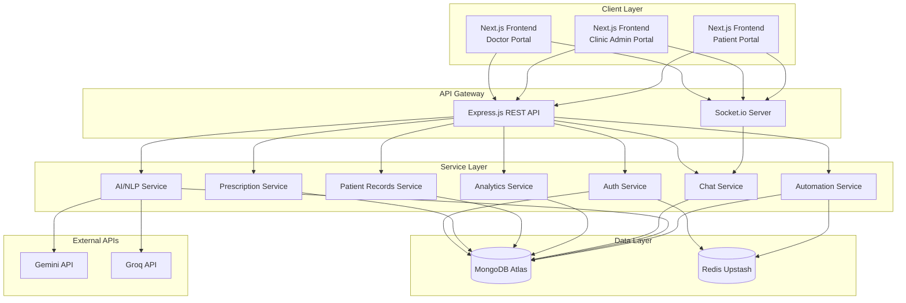
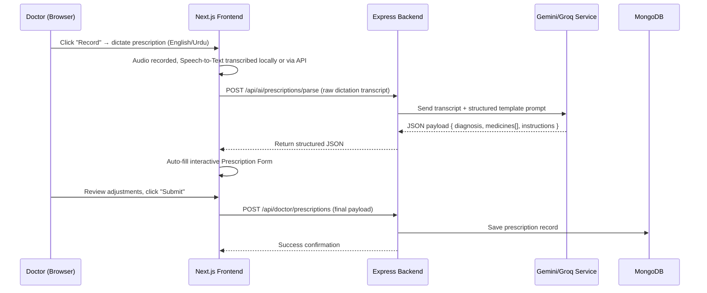
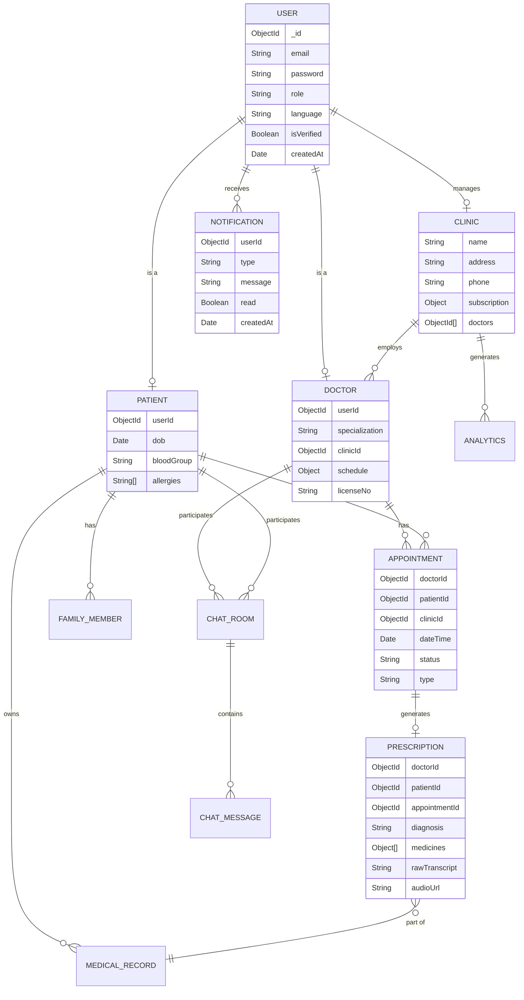

# MedEaz — Voice-Enabled Digital Healthcare Platform

MedEaz is a web-based SaaS healthcare platform built for the Pakistani market. It connects patients, doctors, and clinic administrators through three dedicated portals, with bilingual support (English/Urdu) and a voice-powered prescription workflow driven by Gemini AI.

> **Type**: SaaS (Web-Based) | **Methodology**: Agile (2-week sprints)

---

## Table of Contents

- [Tech Stack](#tech-stack)
- [System Architecture](#system-architecture)
- [Project Structure](#project-structure)
- [Modules](#modules)
  - [Authentication & Onboarding](#module-1-authentication-authorization--onboarding)
  - [Doctor Portal](#module-2-doctor-portal)
  - [Clinic Admin Portal](#module-3-clinic-admin-portal)
  - [Patient Portal](#module-4-patient-portal)
  - [Live Chat](#module-5-live-chat)
  - [AI Integration](#module-6-ai-integration-gemini--groq)
  - [Automation Engine](#module-7-automation-engine)
  - [Notifications](#module-8-notifications)
  - [Multilingual Support](#module-9-multilingual-support-english--urdu)
- [Database Schema](#database-schema)
- [Design System](#design-system)
- [Environment Variables](#environment-variables)
- [Getting Started](#getting-started)

---

## Tech Stack

| Layer | Technology | Purpose |
|---|---|---|
| **Frontend** | Next.js 16+ (App Router, Turbopack) | SSR, routing, pages |
| **UI** | React 19+, Tailwind CSS v4, Framer Motion | Components, premium responsive styling, fluid animations |
| **State** | Redux Toolkit (RTK Query) | API data fetching, caching, mutations, and local store |
| **Backend** | Node.js + Express.js | REST API server |
| **Database** | MongoDB Atlas + Mongoose | Primary data store |
| **Cache** | Redis (Upstash) | Session management, rate limiting, token blacklist caching |
| **AI/NLP** | Google Gemini API / GROQ API | Clinical Copilots, Chatbots, Prescription Parsing, Speech-to-Text |
| **Realtime** | Socket.IO | Live chat, real-time statuses, and notifications |
| **Auth** | JWT + bcrypt / NextAuth.js | Role-based JWT auth & Google OAuth integration |
| **Scheduling** | node-cron | Reservation cleanup, automated follow-ups, notification pruning |
| **i18n** | next-intl | English/Urdu locale support with RTL switching |
| **Deployment** | Vercel (Frontend & Backend), MongoDB Atlas | Serverless production hosting |

---

## System Architecture



---

## Project Structure

```
medeaz/
├── client/           # Next.js frontend (all portals)
├── api/              # Express.js backend
├── .gitignore
└── README.md
```

### Frontend (`client/`)

```
client/
├── package.json
├── next.config.ts
├── tailwind.config.ts
├── postcss.config.mjs
├── eslint.config.mjs
├── components.json
├── tsconfig.json
├── i18n.ts
├── proxy.ts
├── types.d.ts
├── Dockerfile
├── public/
│   ├── Hero.png
│   └── medeaz.jpeg
├── app/
├── components/
│   ├── ui/
│   ├── auth/
│   ├── doctor/
│   ├── clinic/
│   ├── patient/
│   ├── chat/
│   └── ai/
├── store/
├── hooks/
├── lib/
├── providers/
└── messages/
    ├── en.json
    └── ur.json
```

### Backend (`api/`)

```
api/
├── index.js                # Entry point — Express app bootstrap + Socket.io + Cron init
├── vercel.json             # Vercel Serverless configuration
├── package.json
├── config/
│   ├── db.js
│   ├── redis.js
│   ├── socket.js
│   └── cloudinary.js
├── middleware/
├── models/
├── controllers/
├── routes/
├── services/
├── socket/                 # Socket.io handlers (chatSocket.js)
├── utils/
└── jobs/                   # Cron scheduling scripts
```

---

## Modules

### Module 1: Authentication, Authorization & Onboarding

NextAuth-based Google OAuth alongside standard Email+Password JWT auth. Protects routes using `authMiddleware` (protect) and `roleMiddleware` (authorize).

| Feature | Endpoint | Detail |
|---|---|---|
| Register | `POST /api/auth/register` | User sign-up, password hashing with bcrypt, verification email |
| Verify Email | `POST /api/auth/verify/:token` | Validate email token and activate account |
| Login | `POST /api/auth/login` | Email + password login returning JWT access & refresh tokens |
| Google Auth | `POST /api/auth/google` | Google sign-in payload verification via idToken & profile syncing |
| Logout | `POST /api/auth/logout` | Revoke tokens, clear cookie, blacklist session |
| Refresh | `POST /api/auth/refresh` | Issue new short-lived access token |
| Forgot Password | `POST /api/auth/forgot-password` | Issue reset password token email |
| Reset Password | `POST /api/auth/reset-password/:token` | Replace password with a new verified one |
| Set Onboarding step | `PATCH /api/auth/onboarding/complete` | Record completion of onboarding stages |
| Onboarding Profile | `PATCH /api/auth/onboarding/profile-complete` | Save detailed onboarding profile parameters |
| Get User Profile | `GET /api/auth/profile` | Retrieve global user authentication metadata |
| Update User Profile | `PUT /api/auth/profile` | Update global profile details (e.g. name, avatar) |

---

### Module 2: Doctor Portal

**Backend** — `controllers/doctor/`, `models/Doctor.js`, `models/Prescription.js`

| Feature | Endpoint | Detail |
|---|---|---|
| My Patients | `GET /api/doctor/patients` | List clinic/assigned patients with pagination |
| Add Patient | `POST /api/doctor/patients` | Manually link a patient profile to doctor |
| Search Patients | `GET /api/doctor/patients/search` | Query patients by name, CNIC, or phone |
| Find Patient Email | `GET /api/doctor/patients/find` | Find patient account details using email |
| Patient Detail | `GET /api/doctor/patients/:id` | View full history, prescriptions, and timeline |
| Remove Patient | `DELETE /api/doctor/patients/:id` | Unlink patient from doctor's list |
| List Prescriptions | `GET /api/doctor/prescriptions` | Retrieve past prescription archives |
| Prescription Detail | `GET /api/doctor/prescriptions/:id` | View exact details of a particular prescription |
| Create Prescription | `POST /api/doctor/prescriptions` | Save a structured prescription to database |
| Edit Prescription | `PUT /api/doctor/prescriptions/:id` | Update prescription metadata |
| Delete Prescription | `DELETE /api/doctor/prescriptions/:id` | Purge prescription history |
| AI Parsing | `POST /api/ai/prescriptions/parse` | Send raw transcript text to generate JSON prescription payload |
| Appointments | `GET /api/doctor/appointments` | Get full upcoming & history logs |
| Create Appointment | `POST /api/doctor/appointments` | Manually book a schedule |
| Today's Queue | `GET /api/doctor/appointments/today` | View list of active patient visits for today |
| Appointment Details | `GET /api/doctor/appointments/:id` | Fetch specific appointment information |
| Update Status | `PUT /api/doctor/appointments/:id` | Accept/reject appointments |
| Start Appointment | `PUT /api/doctor/appointments/:id/start` | Update state to `in-progress` |
| Complete Visit | `PUT /api/doctor/appointments/:id/complete` | Complete visit and tag prescription |
| Delete Appointment | `DELETE /api/doctor/appointments/:id` | Remove from appointment rosters |
| Weekly Slots | `GET /api/doctor/schedule/week` | Fetch current week slots structure |
| Get/Set Schedule | `GET /api/doctor/schedule` & `PUT /api/doctor/schedule` | Retrieve/Update overall weekly schedule configuration |
| Day Schedule | `PUT /api/doctor/schedule/:day` | Edit schedule constraints for a single day |
| Available Slots | `GET /api/doctor/schedule/slots` | Fetch all slots calculated by active schedules |
| Add Slots | `POST /api/doctor/schedule/:day/slots` | Add precise appointment slots |
| Remove Slots | `DELETE /api/doctor/schedule/:day/slots/:slotIndex` | Remove custom slot |
| Revenue Dashboard | `GET /api/doctor/revenue` | View active revenue stats (daily, weekly, monthly summaries) |
| Revenue History | `GET /api/doctor/revenue/history` & `DELETE /api/doctor/revenue/history` | Manage doctor consultation payment archives |

#### Voice & AI Prescription Flow



---

### Module 3: Clinic Admin Portal

**Backend** — `controllers/clinic/`, `models/Clinic.js`, `services/analyticsService.js`

| Feature | Endpoint | Detail |
|---|---|---|
| Dashboard Stats | `GET /api/clinic/analytics/overview` | Active doctors count, patients flow, revenue summary |
| Patient Flow | `GET /api/clinic/analytics/patient-flow` | Aggregated data representing patient check-ins |
| Revenue Report | `GET /api/clinic/analytics/revenue` | Periodic income breakdowns |
| Revenue History | `GET /api/clinic/analytics/revenue-history` | Audit trail of transactions |
| Manage Doctors | `GET` / `POST` / `DELETE /api/clinic/doctors` | List, add (invite), and remove doctors in the clinic roster |
| Search Doctors | `GET /api/clinic/doctors/search` | Search doctor registries by email |
| Doctor Performance | `GET /api/clinic/doctors/:id/stats` | Audit active queue, completed visits, fees |
| Clinic Appointments | `GET` / `GET :id` / `DELETE /api/clinic/appointments` | General clinic-wide appointment tracking |
| Prescriptions | `GET /api/clinic/prescriptions` & `DELETE /api/clinic/prescriptions/:id` | Access/delete prescriptions history |
| Clinic Settings | `GET` / `PUT /api/clinic/settings` | General info, address, operating hours |
| Staff Management | `GET` / `POST` / `PUT` / `DELETE /api/clinic/staff` | Roster actions for staff / receptionists |
| Patient Operations | `GET` / `POST` / `GET :id` / `DELETE /api/clinic/patients` | Core patient registration, profile tracking, medical records deletion |

---

### Module 4: Patient Portal

**Backend** — `controllers/patient/`, `models/Patient.js`, `models/MedicalRecord.js`

| Feature | Endpoint | Detail |
|---|---|---|
| Dashboard Stats | `GET /api/patient/dashboard` | Upcoming bookings, family count, recent vitals |
| Spent History | `GET /api/patient/spent-history` | Track total medical consultations expenditure |
| Health Timeline | `GET /api/patient/records` | Comprehensive list of active & past prescriptions |
| Upload Record | `POST /api/patient/records/upload` | Upload medical document PDFs/Images |
| Record Details | `GET /api/patient/records/:id` & `DELETE /api/patient/records/:id` | Retrieve or delete specific records |
| View Appointments | `GET /api/patient/appointments` | Filters: upcoming, past, all |
| Reserve Slot | `POST /api/patient/appointments/reserve-slot` | Hold a slot temporarily for 5 mins while checking out |
| Available Slots | `GET /api/patient/appointments/available-slots` | Fetch real-time available calendar spaces |
| Book Appointment | `POST /api/patient/appointments` | Complete reservation booking |
| Cancel Booking | `PUT /api/patient/appointments/:id/cancel` | Update status to cancelled |
| Rate & Review | `PUT /api/patient/appointments/:id/rate` | Submit doctor consultation reviews |
| Directory Search | `GET /api/patient/doctors` & `GET /api/patient/clinics` | Discover verified healthcare professionals |
| Connection Requests | `GET` / `PUT /api/patient/connections/requests` | Doctor/Clinic authorization request tracking |
| Feedback Reviews | `POST` / `PUT /api/patient/reviews` | Write and manage submitted feedback |
| Family Management | `GET` / `POST` / `PUT` / `DELETE /api/patient/family` | Add, update, delete dependants profiles |
| Family Records | `GET` / `POST` / `DELETE /api/patient/family/:memberId/records` | Retrieve or add medical documents for family members |
| Profile | `GET` / `PUT /api/patient/profile` | Update DOB, blood group, allergies, profile picture |
| Security | `PUT /api/patient/profile/password` | Change login credentials |

---

### Module 5: Live Chat

Real-time instant communication engine connecting doctors and patients, using Socket.IO as primary and REST routes as fallback.

#### HTTP API (Prefix: `/api/chat`)
- `GET /api/chat/conversations` — Retrieve conversation list for logged-in user
- `POST /api/chat/conversations` — Start or locate an existing room between doctor & patient
- `GET /api/chat/conversations/:conversationId/messages` — Fetch paginated messaging logs
- `PUT /api/chat/conversations/:conversationId/read` — Clear unread count flags
- `DELETE /api/chat/conversations/:conversationId` — Remove conversation thread
- `DELETE /api/chat/messages/:messageId` — Delete single message
- `POST /api/chat/conversations/:conversationId/upload` — Upload media (images/documents) to Cloudinary

#### Socket.IO Real-time Events
- `join` — Subscribe socket connections to a user-specific room
- `send_message` — Deliver message payloads immediately to active recipient
- `typing` / `stop_typing` — Broadcast user activity signals
- `user_status` — Broadcast online/offline states

---

### Module 6: AI Integration (Gemini & Groq)

State-of-the-art Clinical Copilots providing contextual intelligence for doctors, clinic administrators, and patients.

#### Multi-Model Support
Configured to use both **Google Gemini API** (`gemini-2.5-flash`/`gemini-2.5-pro`) and **GROQ API** (`llama-3.3-70b`) with built-in fallbacks.

| Route | Authorized | Purpose |
|---|---|---|
| `POST /api/ai/patient-assistant/query` | Patient | Symptoms triage and healthcare query assistant |
| `POST /api/ai/clinic-ops/query` | Clinic Admin | Conversational analytics over clinic performance metrics |
| `POST /api/ai/doctor-copilot/query` | Doctor | Interactive medical lookup, drug interactions, and dosing copilot |
| `POST /api/ai/prescriptions/parse` | Doctor | Transforms raw transcripts (English, Urdu, or Roman Urdu) into structured JSON |
| `POST /api/ai/gemini/chat` / `groq/chat` | Patient | General chat endpoints with conversation history |
| `POST /api/ai/gemini/health-advice` / `groq/health-advice` | Patient | General health advisory queries |

---

### Module 7: Automation Engine

Background workers powered by `node-cron` running continuously on local hosts.

| Job | Frequency | Purpose |
|---|---|---|
| **Reservation Cleanup** | Every 1 minute | Deletes unfinalized `reserved` appointments older than 5 minutes |
| **Notification Cleanup** | Daily (Midnight) | Deletes expired notification logs older than 10 days |
| **Appointment Reminders** | Every 1 hour | Scans database and alerts patients (24h & 2h before) and doctors (24h & 30m before) |
| **Follow-Up Reminders** | Every 6 hours | Notifies patients due for post-consultation clinic follow-ups |

---

### Module 8: Notifications

Managed by `services/notificationService.js`. Synchronizes db logs with live Socket.IO alerts:
- **Triggers**: Booking alerts, status changes (accept/cancel), chat notifications, prescription uploads.
- **Client**: Bell notification feed located in `Topbar.tsx` retrieving alerts via RTK Query and updating in real-time.

---

### Module 9: Multilingual Support (English / Urdu)

Comprehensive localization across all landing pages, authentication views, and dashboard portals.

- **Library**: `next-intl`
- **Layout**: Dynamic RTL layout tracking active locale (`dir="rtl"` applied to `<html>` for Urdu).
- **Styling**: Tailwind logical properties (`ms-*`, `me-*`, `start-*`, `end-*`) for automatic flipping.
- **Urdu Font**: [Noto Nastaliq Urdu](https://fonts.google.com/noto/specimen/Noto+Nastaliq+Urdu)
- **Latin Font**: [Hedvig Letters Sans](https://fonts.google.com/specimen/Hedvig+Letters+Sans)

---

## Database Schema



---

## Design System

- **Brand Primary**: `#00b495` (Teal)
- **Dark Mode**: Configured via `next-themes` (`class` strategy).
- **Core Variables (Light/Dark)**:
  - Primary Accent: `--color-primary` (`#00b495`)
  - Primary Hover: `--color-primary-hover` (`#19bca0`)
  - Accent Background: `--color-primary-bg` (Light: `#e6f8f4`, Dark: `#0d2b24`)
  - Surface Accent: `--color-surface` (Light: `#e5e5e5`, Dark: `#27272a`)

---

## Environment Variables

#### `api/.env`
```env
PORT=5000
MONGO_URI=mongodb://localhost:27017/medeaz
UPSTASH_REDIS_REST_URL=your_upstash_redis_url
UPSTASH_REDIS_REST_TOKEN=your_upstash_redis_token
JWT_SECRET=your_jwt_secret
JWT_REFRESH_SECRET=your_jwt_refresh_secret
SMTP_HOST=smtp.gmail.com
SMTP_PORT=587
SMTP_USER=your_smtp_user
SMTP_PASS=your_smtp_pass
FRONTEND_URL=http://localhost:3000
GEMINI_API_KEY=your_gemini_api_key
FORCE_GEMINI=false
GROQ_API_KEY=your_groq_api_key
CLOUDINARY_CLOUD_NAME=your_cloudinary_cloud_name
CLOUDINARY_API_KEY=your_cloudinary_api_key
CLOUDINARY_API_SECRET=your_cloudinary_api_secret
GOOGLE_CLIENT_ID=your_google_client_id_here
```

#### `client/.env`
```env
NEXT_PUBLIC_API_URL=http://localhost:5000/api
NEXT_PUBLIC_SOCKET_URL=http://localhost:5000

GOOGLE_CLIENT_ID=your_google_client_id_here
GOOGLE_CLIENT_SECRET=your_google_client_secret_here
NEXTAUTH_URL=http://localhost:3000
NEXTAUTH_SECRET=your_nextauth_secret_here
```

---

## Advanced Platform Features

### 1. Real-time OPD Queue Management & TV Display Board
MedEaz includes an automated outpatient department (OPD) queue system that replaces traditional paper tokens:
- **Interactive Console**: Clinic receptionists can issue tokens directly from today's scheduled appointment slots, call/recall active tokens, skip non-responsive patients (moving them to the bottom), or complete visits.
- **TV Display Board (`/display/:clinicId/opd-queue`)**: A dedicated public TV view designed for clinic waiting rooms. It plays chime alerts and lists the *Now Calling* token, *Next Tokens*, and doctor assignments in real-time using Socket.IO events (`opd_token_issued`, `opd_token_called`, `opd_token_completed`, `opd_token_skipped`).

### 2. Olympic Performance Board & 20/80 Financial Splits
A gamified doctor performance leaderboard helps clinic administrators view top performers:
- **Olympic Podium Layout**: Visually highlights the top 3 doctors in the clinic by completed consultations, total patient flow, and ratings.
- **Medeaz Split Revenue Ledger**: Automatically partitions incoming appointment billing:
  - **Clinic Share (20%)**: Retained by the clinic for facilities and operations.
  - **Doctor Share (80%)**: Assigned to the doctor's payout.
  All performance charts, daily stats, and CSV exports dynamically track these specific split-shares.

### 3. Patient Health Score Gauge
Patient profiles calculate a real-time clinical health score (0–100) using a dynamic rule engine:
- **Dynamic Indicators**: Aggregates body mass index (BMI), blood pressure records, chronic allergies, family history, and routine vitals uploads.
- **Circular SVG Gauge**: Renders inside doctor and clinic portals, color-coding scores dynamically (Red for risk, Yellow for warning, Green for optimal wellness).

### 4. Patient Feedback & Verified Visit Reviews
Comprehensive reviews engine for doctors and clinics:
- **Multi-Dimensional Metrics**: Patients can rate cleanliness, wait time, staff, and facilities alongside overall experience.
- **Verified Badge**: Integrates with booking records to label reviews as *Verified Visit* if the patient completed their appointment at the clinic.
- **Clinic Admin Response**: Administrators can directly address patient comments inside the portal.
- **Advanced Query Aggregations**: Supports casted MongoDB ObjectIds to compute accurate review metrics, response rates, and daily feedback analytics.

### 5. Multi-lingual RTL & Urdu Nastaliq Typography
SaaS healthcare built specifically for the local Pakistani landscape:
- **RTL Mode Switcher**: Toggles HTML directions (`dir="rtl"`) for bilingual English/Urdu translations using `next-intl`.
- **Nastaliq Script Rendering**: Incorporates `Noto Nastaliq Urdu` fonts with optimized line heights, logical property alignments, and flipped arrow icons.

### 6. Teal branded CSV Export Reports
Custom branded data export utility for reviews and performance analytics:
- **MedEaz Branding**: Export CSV buttons are styled in custom premium MedEaz Teal (`#00b495`).
- **Cleaned Data Structures**: Automatically strips redundant technical DB columns to export simple, clean data spreadsheets directly readable by Microsoft Excel or Google Sheets.

---

## Getting Started

### Prerequisites
- Node.js (v18+)
- MongoDB running locally or a MongoDB Atlas URI
- Redis service running or Upstash Redis endpoints

### Installation & Run

```bash
# Clone the repository
git clone https://github.com/AliRana30/medeaz.git
cd medeaz

# 1. Start the API backend
cd api
npm install
# Create .env from the configuration above
npm run dev

# 2. Start the Frontend client
cd ../client
npm install
# Create .env from the configuration above
npm run dev
```
### Made By 

- Ali Mahmood Rana
- Ahad Ali
- Muhammad Shaheer