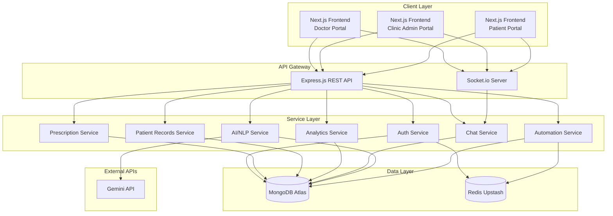
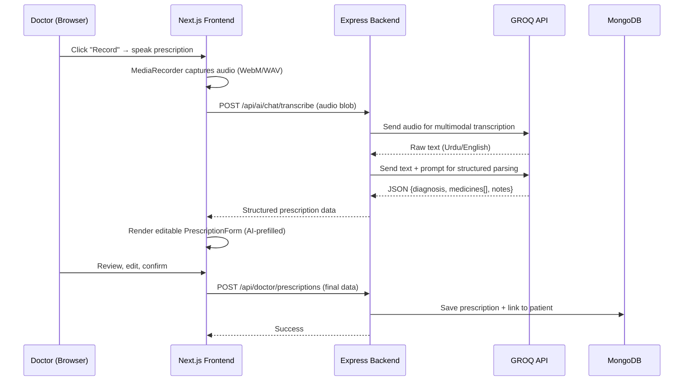
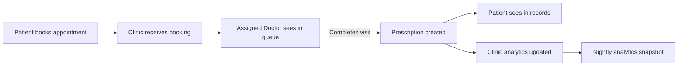
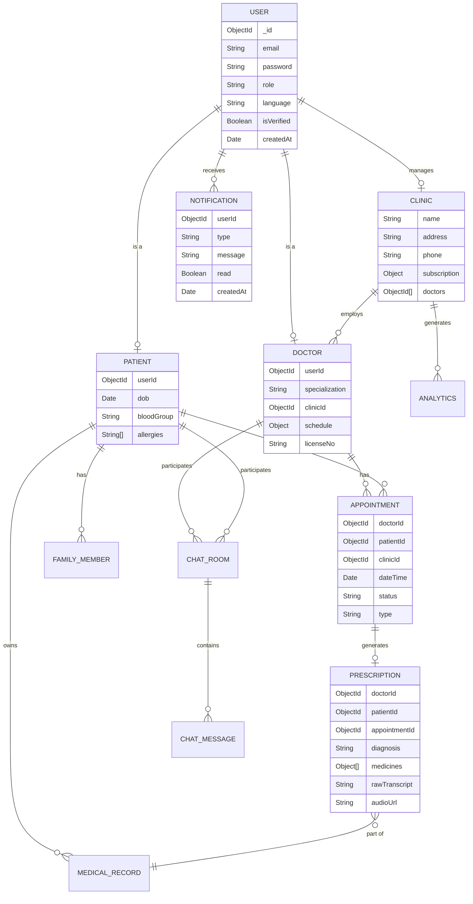

# MedEaz — Voice-Enabled Digital Healthcare Platform

MedEaz is a web-based SaaS healthcare platform built for healthcare. It connects patients, doctors, and clinic administrators through three dedicated portals, with bilingual support (English/Urdu) and a voice-powered prescription workflow driven by Gemini AI.

> **Type**: SaaS (Web-Based) |

---

## Table of Contents

- [Tech Stack](#tech-stack)
- [System Architecture](#system-architecture)
- [Project Structure](#project-structure)
- [Modules](#modules)
  - [Authentication](#module-1-authentication--authorization)
  - [Doctor Portal](#module-2-doctor-portal)
  - [Clinic Admin Portal](#module-3-clinic-admin-portal)
  - [Patient Portal](#module-4-patient-portal)
  - [Live Chat](#module-5-live-chat)
  - [AI Integration](#module-6-ai-integration-gemini)
  - [Automation Engine](#module-7-automation-engine)
  - [Notifications](#module-8-notifications)
  - [Multilingual Support](#module-9-multilingual-support-english--urdu)
- [Database Schema](#database-schema)
- [Design System](#design-system)
- [Environment Variables](#environment-variables)
- [Getting Started](#getting-started)

---

## Tech Stack

| Layer | Technology | Purpose |
|---|---|---|
| **Frontend** | Next.js 16+ (App Router, Turbopack) | SSR, routing, pages |
| **UI** | React 19+, Tailwind CSS v4 | Components, responsive styling |
| **State** | Redux Toolkit Query (RTK Query) | API data fetching, caching, mutations |
| **Backend** | Node.js + Express.js | REST API server |
| **Database** | MongoDB Atlas + Mongoose | Primary data store |
| **Cache** | Redis (Upstash) | Session management, rate limiting, caching |
| **AI/NLP** | Google Gemini API / GROQ API| Chatbot, Speech-to-Text, Prescription Parsing |
| **Realtime** | Socket.IO | Live chat, notifications |
| **Auth** | JWT + bcrypt | Token-based authentication |
| **Scheduling** | node-cron | Automated follow-ups, reminders |
| **i18n** | next-intl | English/Urdu locale support with RTL switching |
| **Deployment** | Vercel (frontend), Render/AWS (backend), MongoDB Atlas | Production hosting |

---

## System Architecture



---

## Project Structure

```
medeaz/
├── client/           # Next.js frontend (all portals)
├── api/              # Express.js backend
├── .gitignore
└── README.md
```

### Frontend (`client/`)

```
client/
├── package.json
├── next.config.js
├── tailwind.config.js
├── postcss.config.js
├── tsconfig.json
├── public/
│   ├── logo-light.svg
│   ├── logo-dark.svg
│   └── favicon.ico
├── app/
├── components/
│   ├── ui/
│   ├── auth/
│   ├── doctor/
│   ├── clinic/
│   ├── patient/
│   ├── chat/
│   └── ai/
├── store/
├── hooks/
├── lib/
├── providers/
├── types/
└── messages/
    ├── en.json
    └── ur.json
```

### Backend (`api/`)

```
api/
├── index.js                # Entry point — Express app bootstrap + Socket.io init
├── .env
├── package.json
├── config/
├── middleware/
├── models/
├── controllers/
├── routes/
├── services/
├── utils/
└── jobs/
```

---

## Modules

### Module 1: Authentication & Authorization

JWT-based auth with role separation across three user types.

| Feature | Endpoint | Detail |
|---|---|---|
| Register | `POST /api/auth/register` | Multi-role registration, bcrypt hash, verification email |
| Login | `POST /api/auth/login` | Email + password → JWT access + refresh token, Redis session |
| Logout | `POST /api/auth/logout` | Invalidate refresh token in Redis |
| Refresh | `POST /api/auth/refresh` | Rotate access token using refresh token |
| Forgot Password | `POST /api/auth/forgot-password` | Send reset link via email |
| Reset Password | `POST /api/auth/reset-password/:token` | Validate token, update password |

- Access token expiry: **15 min** | Refresh token: **7 days** (stored in Redis)
- Roles: `doctor`, `clinic_admin`, `patient`
- Route protection via `authMiddleware` + `roleMiddleware`

---

### Module 2: Doctor Portal

**Backend** — `controllers/doctor/`, `models/Doctor.js`, `models/Prescription.js`

| Feature | Endpoint | Detail |
|---|---|---|
| My Patients | `GET /api/doctor/patients` | List patients with pagination and search |
| Add Patient | `POST /api/doctor/patients` | Manually add a patient to doctor's list |
| Patient Detail | `GET /api/doctor/patients/:id` | Full history, records, prescriptions |
| Delete Patient | `DELETE /api/doctor/patients/:id` | Remove patient from doctor's list |
| Create Prescription | `POST /api/doctor/prescriptions` | Save structured prescription (manual or AI-parsed) |
| Edit Prescription | `PUT /api/doctor/prescriptions/:id` | Update prescription before finalization |
| Delete Prescription | `DELETE /api/doctor/prescriptions/:id` | Remove a prescription record |
| Voice Prescription | `POST /api/ai/chat/transcribe` | Audio → GROQ transcription → structured parsing |
| My Appointments | `GET /api/doctor/appointments` | Today's queue + upcoming |
| Update Appointment | `PUT /api/doctor/appointments/:id` | Accept / reject / complete |
| Get Schedule | `GET /api/doctor/schedule` | Fetch weekly availability slots |
| Save Schedule | `PUT /api/doctor/schedule` | Persist updated weekly slots to DB |

#### Voice Prescription Flow



---

### Module 3: Clinic Admin Portal

**Backend** — `controllers/clinic/`, `models/Clinic.js`, `services/analyticsService.js`

| Feature | Endpoint | Detail |
|---|---|---|
| Dashboard Stats | `GET /api/clinic/analytics/overview` | Today's patients, total revenue, active doctors |
| Patient Flow | `GET /api/clinic/analytics/patient-flow` | Patients/day over time (chart data) |
| Revenue Reports | `GET /api/clinic/analytics/revenue` | Revenue breakdown by period |
| List Doctors | `GET /api/clinic/doctors` | All doctors linked to this clinic |
| Add Doctor | `POST /api/clinic/doctors` | Invite a doctor by email |
| Remove Doctor | `DELETE /api/clinic/doctors/:id` | Unlink doctor from clinic |
| Doctor Performance | `GET /api/clinic/doctors/:id/stats` | Appointments completed, avg visit time |
| All Appointments | `GET /api/clinic/appointments` | Clinic-wide view with filters |
| Get Clinic Settings | `GET /api/clinic/settings` | Fetch clinic profile, working hours |
| Save Clinic Settings | `PUT /api/clinic/settings` | Persist clinic profile + working hours |
| Staff Management | `GET /api/clinic/staff` | List all staff/receptionist accounts |
| Add Staff | `POST /api/clinic/staff` | Create staff account |
| Edit Staff | `PUT /api/clinic/staff/:id` | Update staff role or details |
| Delete Staff | `DELETE /api/clinic/staff/:id` | Remove staff account |

#### Data Sync Flow



---

### Module 4: Patient Portal

**Backend** — `controllers/patient/`, `models/Patient.js`, `models/MedicalRecord.js`, `models/FamilyMember.js`

| Feature | Endpoint | Detail |
|---|---|---|
| Dashboard Stats | `GET /api/patient/dashboard` | Appointments this week/month, doctors visited, total prescriptions |
| Health Timeline | `GET /api/patient/records` | All prescriptions chronologically |
| Record Detail | `GET /api/patient/records/:id` | Full prescription with medicines, dosage, follow-up, doctor info |
| My Appointments | `GET /api/patient/appointments` | All appointments — `?view=upcoming\|past\|all` |
| Book Appointment | `POST /api/patient/appointments` | Select clinic + doctor + slot → book |
| Cancel Appointment | `PUT /api/patient/appointments/:id/cancel` | Cancel a pending appointment |
| Add Family Member | `POST /api/patient/family` | Create family member profile |
| Edit Family Member | `PUT /api/patient/family/:memberId` | Update details |
| Delete Family Member | `DELETE /api/patient/family/:memberId` | Remove family member |
| List Family Members | `GET /api/patient/family` | All family members |
| Family Records | `GET /api/patient/family/:memberId/records` | Family member's prescription history |
| AI Assistant | `POST /api/ai/gemini/chat` | Health queries with conversation history |
| Get Profile | `GET /api/patient/profile` | Name, DOB, blood group, allergies, contact |
| Update Profile | `PUT /api/patient/profile` | Update profile including photo |
| Change Password | `PUT /api/patient/profile/password` | Old + new password |

---

### Module 5: Live Chat

**Backend** — `controllers/chat/`, `config/socket.js`, `models/ChatMessage.js`

| Component | Detail |
|---|---|
| **Socket Events** | `connection`, `join-room`, `send-message`, `typing`, `stop-typing`, `user-online`, `disconnect` |
| **REST Fallback** | `GET /api/chat/rooms`, `GET /api/chat/rooms/:id/messages` |
| **Room Logic** | 1-to-1 rooms (doctor ↔ patient), auto-created on first message |
| **Storage** | Messages persisted to MongoDB, last 50 cached in Redis |

**Frontend** — `components/chat/`
- `ChatWindow.tsx` — message list, input, send
- `ChatSidebar.tsx` — active conversations + unread badges
- Socket connection via `useSocket.ts` hook, managed by `SocketProvider.tsx`
- Message history loaded via REST on room open; socket takes over for live updates

---

### Module 6: AI Integration (Gemini/Groq)

**Backend** — `controllers/ai/`, `services/geminiService.js`

#### Gemini/Groq Chatbot (Patient AI Assistant)

| | |
|---|---|
| **Endpoint** | `POST /api/ai/gemini/chat` |
| **Input** | `{ message, conversationHistory[] }` |
| **Processing** | System prompt (medical context) + full conversation history → Gemini/Groq |
| **Output** | Markdown-formatted health guidance |
| **Guardrails** | Disclaimer injection, emergency detection, no diagnosis claims |

#### Voice Transcription

| | |
|---|---|
| **Endpoint** | `POST /api/ai/chat/transcribe` |
| **Input** | Audio file (multipart, max 25MB) |
| **Processing** | Gemini/Groq multimodal — supports Urdu and English |
| **Output** | `{ text, language, success }` |

#### Prescription Parser

| | |
|---|---|
| **Endpoint** | `POST /api/ai/gemini/parse-prescription` |
| **Input** | Raw transcribed text |
| **Processing** | Gemini/Groq extracts medicines, dosage, frequency, diagnosis, notes |
| **Output** | Structured JSON prescription object |

---

### Module 7: Automation Engine

**Backend** — `controllers/automation/`, `jobs/`, `services/notificationService.js`

| Job | Schedule | Detail |
|---|---|---|
| **Follow-Up Reminder** | Every 6 hours | Checks patients due for follow-up → push notification + email |
| **Appointment Reminder** | Every hour | Reminds patients 24h and 1h before appointment |
| **Analytics Snapshot** | Daily 2 AM | Aggregates daily clinic stats → saves to `Analytics` collection |

All three jobs are registered at app startup in `index.js`. `notificationService.js` handles both DB persistence and Socket.IO delivery simultaneously. Offline users receive missed notifications on next connection.

---

### Module 8: Notifications

**Backend** — `services/notificationService.js`, `models/Notification.js`

| Type | Trigger | Channel |
|---|---|---|
| New Appointment | Patient books | Socket.IO + DB |
| Appointment Status | Doctor accepts/rejects | Socket.IO + DB |
| New Prescription | Doctor completes visit | Socket.IO + DB |
| Follow-Up Due | Cron job | Socket.IO + Email |
| New Chat Message | Socket event | Socket.IO (live) |

**Endpoints** — `GET /api/notifications`, `PUT /api/notifications/:id/read`, `PUT /api/notifications/read-all`

**Frontend** — Bell icon in `Topbar.tsx` with unread badge, powered by `useNotifications.ts` which fetches initial unread state via RTK Query on mount and subscribes to socket events for live updates.

---

### Module 9: Multilingual Support (English / Urdu)

Full bilingual support across all three portals, auth pages, and the landing page.

| Item | Detail |
|---|---|
| **Languages** | English (default), Urdu |
| **Direction** | RTL layout when Urdu is active (`dir="rtl"` on `<html>`) |
| **Library** | `next-intl` |
| **Storage** | `localStorage` (`medeaz_lang`) + synced to user profile in DB |
| **Scope** | All portals — UI text, labels, buttons, toasts, placeholders, navigation |

**Fonts:**
- Latin text: [Hedvig Letters Sans](https://fonts.google.com/specimen/Hedvig+Letters+Sans)
- Urdu script: [Noto Nastaliq Urdu](https://fonts.google.com/noto/specimen/Noto+Nastaliq+Urdu)

**Translation files:**
```
client/messages/
├── en.json
└── ur.json
```

**RTL layout** uses Tailwind's logical properties throughout — `ms-`/`me-` instead of `ml-`/`mr-`, `ps-`/`pe-` instead of `pl-`/`pr-`, `start-`/`end-` for positioning — so the layout mirrors automatically when Urdu is active.

**Language endpoints:**

| Method | Route | Description |
|---|---|---|
| `PUT` | `/api/user/language` | Save preference (`en` or `ur`) to DB |
| `GET` | `/api/user/language` | Fetch saved preference |

What does not get translated: doctor/patient names, medicine names (medical terminology stays in English), email addresses, PKR currency amounts, date/time formats (handled via `Intl.DateTimeFormat`).

---

## Database Schema



---

## Design System

**Brand color:** `#00b495` (teal) — consistent across light and dark mode.

**Fonts:**
- Latin: [Hedvig Letters Sans](https://fonts.google.com/specimen/Hedvig+Letters+Sans)
- Urdu: [Noto Nastaliq Urdu](https://fonts.google.com/noto/specimen/Noto+Nastaliq+Urdu)

Dark mode via `next-themes` with `class` strategy.

### Color Palette

#### Light Mode

| Token | Hex | Usage |
|---|---|---|
| `--color-primary` | `#00b495` | Buttons, links, active states |
| `--color-primary-hover` | `#19bca0` | Hover/focus state |
| `--color-primary-light` | `#4dcbb5` | Tags, badges, light accents |
| `--color-primary-muted` | `#b3e9df` | Selected rows, highlights |
| `--color-primary-bg` | `#e6f8f4` | Card backgrounds, section tints |
| `--color-white` | `#ffffff` | Page background, card surfaces |
| `--color-text-primary` | `#000000` | Body text |
| `--color-text-secondary` | `#1a1a1c` | Labels, captions |
| `--color-text-muted` | `#4a4a4d` | Disabled text, timestamps |
| `--color-border` | `#d1d1d6` | Input borders, dividers |
| `--color-surface` | `#e5e5e5` | Sidebar bg, skeleton loaders |

#### Dark Mode

| Token | Hex | Usage |
|---|---|---|
| `--color-primary` | `#00b495` | Same across modes |
| `--color-primary-muted` | `#1a3d35` | Selected rows, highlights |
| `--color-primary-bg` | `#0d2b24` | Card tints, alert backgrounds |
| `--color-white` | `#1e293b` | Page background (dark) |
| `--color-text-primary` | `#ffffff` | Body text |
| `--color-text-muted` | `#71717a` | Disabled text, timestamps |
| `--color-border` | `#27272a` | Input borders, dividers |
| `--color-surface` | `#27272a` | Sidebar, card surfaces |

---

## Environment Variables

**`api/.env`**

```env
PORT=5000
MONGO_URI=mongodb://localhost:27017/medeaz
UPSTASH_REDIS_REST_URL=your_upstash_redis_url
UPSTASH_REDIS_REST_TOKEN=your_upstash_redis_token
JWT_SECRET=your_jwt_secret
JWT_REFRESH_SECRET=your_jwt_refresh_secret
SMTP_HOST=smtp.gmail.com
SMTP_PORT=587
SMTP_USER=your_smtp_user
SMTP_PASS=your_smtp_pass
FRONTEND_URL=http://localhost:3000
GEMINI_API_KEY=your_gemini_api_key
FORCE_GEMINI=false
GROQ_API_KEY=your_groq_api_key
CLOUDINARY_CLOUD_NAME=your_cloudinary_cloud_name
CLOUDINARY_API_KEY=your_cloudinary_api_key
CLOUDINARY_API_SECRET=your_cloudinary_api_secret
GOOGLE_CLIENT_ID=your_google_client_id_here
```

**`client/.env.local`**

```env
NEXT_PUBLIC_API_URL=http://localhost:5000/api
NEXT_PUBLIC_SOCKET_URL=http://localhost:5000

GOOGLE_CLIENT_ID=your_google_client_id_here
GOOGLE_CLIENT_SECRET=your_google_client_secret_here
NEXTAUTH_URL=http://localhost:3000
NEXTAUTH_SECRET=your_nextauth_secret_here
```

---

## Getting Started

```bash
# Clone
git clone https://github.com/AliRana30/medeaz.git
cd medeaz

# Backend
cd api
npm install
cp .env.example .env   # fill in your values
npm run dev

# Frontend
cd ../client
npm install
cp .env.example  # fill in your values
npm run dev
```
